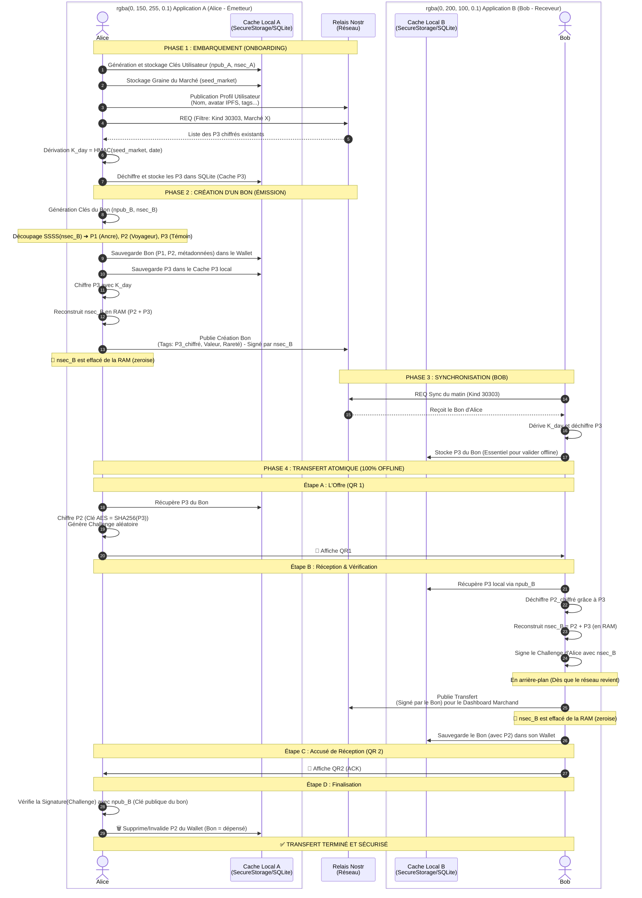

# TrocZen — Résumé du Projet

**Retour à la [Documentation Principale](README.md)** | [Architecture](ARCHITECTURE.md) | [Whitepaper](007.md)

---

## Résumé exécutif

**TrocZen** est une application mobile Flutter permettant de créer, transférer et encaisser des bons de valeur locale (ẐEN) de manière sécurisée et 100% offline après synchronisation initiale.

Caractéristiques principales :
- **Offline-first** — fonctionne sans Internet sur le marché
- **Cryptographiquement sécurisé** — SSSS polynomial + AES-GCM + secp256k1 (98% score industrie)
- **Décentralisé** — pas de serveur central, protocole Nostr
- **Atomique** — double scan empêche toute double dépense
- **Simple** — interface ludique inspirée des cartes Panini

---

## État du projet (Protocole v6)

**Statut** : Production-ready pour pilote terrain (Score Sécurité Crypto : 99%).

### Fonctionnel ✅

| Composant | Détail |
|-----------|--------|
| Cryptographie | SSSS (2,3) natif (`Uint8List`), AES-GCM, Schnorr (`bip340`), Nettoyage RAM agressif. |
| Modèles | User, Bon (rareté, unicité Pokémon-like, stats), Market (checksum ID). |
| Stockage | Séparation stricte : `SecureStorage` (Wallet/Clés) vs `SQLite` (Cache P3/Dashboard). |
| Économie (v6)| DU Hyper-relativiste basé sur la WoT Nostr (N1/N2). Révélation de circuit (Kind 30304). |
| Format QR | v1 (177 octets) et v2 (240 octets, inclut challenge + signature Schnorr). |
| WoTx2 | Certification de compétences par les pairs (Kind 30501, 30502, 30503). |
| Navigation | MainShell (IndexedStack) avec 4 onglets persistants. |
| Tests | 68 tests (52 unitaires + 16 intégrations complètes), 100% passants. |

### En cours / à compléter 🚧

| Fonctionnalité | Priorité | Effort estimé |
|----------------|----------|---------------|
| Tests d'intégration end-to-end | Haute | 3–4h |
| Tests sur appareils réels (NFC) | Haute | 2h |

---

## Architecture en bref

```
lib/
├── main.dart
├── models/         user, bon, market, nostr_profile, onboarding_state
├── services/       crypto, qr, storage, nostr, api, audit_trail, burn, nfc, feedback
├── screens/        wallet, create_bon, offer, scan, ack, atomic_swap, market,
│                   merchant_dashboard, onboarding/*, main_shell, views/*
└── widgets/        panini_card, cached_profile_image, bon_reception_confirm_sheet
```

Voir [ARCHITECTURE.md](ARCHITECTURE.md) pour le détail complet des flux et du protocole.

---

## Métriques techniques

| Métrique | Valeur |
|----------|--------|
| Lignes Dart | ~3 500 |
| Fichiers Dart | ~30 |
| Lignes Python (API) | ~600 |
| Taille APK arm64 | ~15 MB |
| Couverture tests crypto | 60% |
| Score sécurité crypto | 98% |

---

## Déploiement recommandé

### Pilote (< 500 utilisateurs)
- Relay Nostr : `wss://relay.copylaradio.com`
- API : `https://zen.copylaradio.com`
- Marché unique, monitoring basique

### Bêta publique (500–5 000 utilisateurs)
- Multi-marchés
- IPFS activé
- Relays multiples (résilience)
- Analytics

### Avant déploiement massif (> 5 000)
Implémenter les 2% de durcissement restants (voir [CHANGELOG_SECURITE.md](CHANGELOG_SECURITE.md)) et réaliser un audit externe.

---

## Commandes essentielles

```bash
# Installation
cd troczen && flutter pub get

# Développement
flutter run

# Tests
flutter test test/crypto_service_test.dart

# Build APK
flutter build apk --split-per-abi --release

# API Backend
cd api && pip install -r requirements.txt && python api_backend.py
```

NB: Configurer .env pour que les remarques des utilisateurs soient postés comme issue github

---

## Diagramme de séquence TrocZen


