	# Flux d'Émission du Dividende Universel (DU) via Nostr P2P

Ce document décrit le flux expérimental de calcul et d'émission d'un Dividende Universel (DU) local, basé sur le graphe social Nostr (follows réciproques) plutôt que sur une blockchain globale comme Duniter.

## Schéma de Flux (Mermaid)

```mermaid
sequenceDiagram
    autonumber
    
    actor Alice
    actor Bob
    actor Charlie
    participant App as TrocZen App (Local)
    participant Nostr as Relais Nostr (TrocZen Box)
    
    %% ÉTAPE 1 : CONSTRUCTION DU GRAPHE SOCIAL
    rect rgb(30, 30, 30)
    Note over Alice, Nostr: 1. Construction de la Toile de Confiance (WoT)
    Alice->>App: Scan QR Profil Bob
    App->>Nostr: Publie Kind 3 (Contact List) : Follow Bob
    Bob->>App: Scan QR Profil Alice
    App->>Nostr: Publie Kind 3 (Contact List) : Follow Alice
    Note over Nostr: Lien réciproque établi (Alice ↔ Bob)
    end
    
    %% ÉTAPE 2 : SYNCHRONISATION ET CALCUL DU RÉSEAU
    rect rgb(40, 40, 40)
    Note over Alice, Nostr: 2. Synchronisation Quotidienne
    Alice->>App: Ouvre l'application (Matin)
    App->>Nostr: REQ Kind 3 (Contacts) & Kind 30303 (Soldes/Bons)
    Nostr-->>App: Retourne le graphe social et les masses monétaires
    
    App->>App: Calcule N1 (Amis directs réciproques)
    App->>App: Calcule N2 (Amis des amis réciproques)
    
    alt N1 < 5
        App->>Alice: Affiche "Confiance insuffisante (N < 5)"
    else N1 >= 5
        App->>App: Calcule M_n1 (Somme ẐEN de N1)
        App->>App: Calcule M_n2 (Somme ẐEN de N2)
    end
    end
    
    %% ÉTAPE 3 : CALCUL DU DU
    rect rgb(30, 30, 30)
    Note over App: 3. Calcul Mathématique du DU_i(t+1)
    App->>App: DU_new = DU_current + C² * (M_n1 + M_n2 / sqrt(N2)) / (N1 + sqrt(N2))
    App->>App: Vérifie plafond journalier & horodatage
    end
    
    %% ÉTAPE 4 : ÉMISSION ET PREUVE
    rect rgb(40, 40, 40)
    Note over Alice, Nostr: 4. Émission du DU
    App->>App: Génère un nouveau Bon ẐEN (Valeur = DU_new)
    App->>App: SSSS(nsec_bon) -> P1, P2, P3
    App->>Nostr: Publie Kind 30303 (P3 chiffré + Preuve de calcul WoT)
    App->>Alice: Affiche "Nouveau DU reçu : +X ẐEN"
    end
    
    %% ÉTAPE 5 : UTILISATION
    rect rgb(30, 30, 30)
    Note over Alice, Charlie: 5. Transfert P2P (Marché)
    Alice->>Charlie: Double Scan QR (Offre -> ACK)
    Note over Alice, Charlie: Le DU injecté circule dans l'économie locale
    end
```

## Explication des Étapes

### 1. Construction de la Toile de Confiance (WoT)
Dans l'écosystème Nostr, les relations sociales sont gérées par les événements de type `Kind 3` (Contact List). Pour qu'un lien soit considéré comme valide pour la création monétaire, il doit être **réciproque** (Alice suit Bob ET Bob suit Alice). Cela simule une certification mutuelle.

### 2. Synchronisation et Calcul du Réseau
Chaque matin, l'application TrocZen se synchronise avec le relais local (la TrocZen Box). Elle télécharge le graphe social et les soldes publics (ou les preuves de masse monétaire).
L'application calcule localement :
- **N1** : Le nombre d'amis directs (follows réciproques).
- **N2** : Le nombre d'amis d'amis (sans double comptage).
- **M_n1** : La masse monétaire détenue par N1.
- **M_n2** : La masse monétaire détenue par N2.

### 3. Calcul Mathématique du DU
Si l'utilisateur possède au moins 5 liens réciproques (seuil de sécurité contre la création de faux comptes Sybil), l'application calcule le nouveau DU selon la formule de la TRM adaptée :
`DU_i(t+1) = DU_i(t) + C² * (M_n1 + M_n2 / sqrt(N2)) / (N1 + sqrt(N2))`

*Note mathématique : L'utilisation de `sqrt(N2)` au dénominateur et pour pondérer `M_n2` permet de conserver l'invariance d'échelle de la TRM (si toute la masse double, le DU double) tout en amortissant l'impact du réseau étendu pour éviter une explosion exponentielle.*

### 4. Émission et Preuve (Monnaie Quantitative)
Plutôt que de générer un seul gros bon avec une valeur décimale complexe (ex: 10.45 ẐEN), l'application **découpe automatiquement ce montant en coupures standards** (1, 2, 5, 10, 20, 50) pour optimiser les échanges et le rendu de monnaie sur le marché.
Pour chaque coupure générée :
- L'application calcule SSSS(nsec_bon) -> P1, P2, P3.
- Elle publie la part P3 sur Nostr (Kind 30303) en y attachant une **preuve de calcul** (les pubkeys des N1 et N2 utilisés pour le calcul). Les autres nœuds pourront vérifier que la création monétaire était légitime.

### 5. Utilisation et Affichage Relativiste
Les nouveaux bons sont ajoutés au portefeuille de l'utilisateur.
Dans l'interface utilisateur (UI), la valeur de chaque bon est affichée de deux manières :
- **Valeur quantitative** : ex. "10 ẐEN" (pour faciliter le calcul mental au marché).
- **Valeur relativiste** : ex. "0.95 DU" (calculée dynamiquement par rapport au DU du jour).
Ils peuvent désormais être dépensés sur le marché via le mécanisme de double scan atomique hors-ligne.

---

## 1️⃣ Ce que “voit” un utilisateur (psychologie simple)

Avec la formule :

[
DU_i(t+1) = DU_i(t) + C^2 \cdot \frac{M_{n1} + \frac{M_{n2}}{\sqrt{N2}}}{N1 + \sqrt{N2}}
]

Un utilisateur comprend très vite, même sans maths :

> 👉 *“Ma création de ẐEN dépend des personnes que je fréquente et de la qualité de leurs réseaux.”*

Ça déclenche **trois moteurs de motivation distincts**.

---

## 2️⃣ Effet n°1 — Incitation forte aux **nouvelles rencontres réelles**

### Pourquoi ?

* Ajouter **un nouveau lien N1** augmente :

  * le numérateur (Mₙ₁)
  * le dénominateur (N1)
* Mais **pas de manière linéaire**

👉 Résultat :

* Un nouveau lien **pauvre mais réel** reste positif
* Un lien fictif (Sybil) est **peu rentable**
* Un lien actif et inséré localement est **très rentable**

### Effet comportemental

* Incitation à :

  * aller sur des marchés
  * rencontrer physiquement
  * créer des follows **réciproques authentiques**
* Désincitation à :

  * créer des faux comptes
  * accumuler des follows passifs

👉 **La rencontre physique devient productive**, mais seulement si elle est sincère.

---

## 3️⃣ Effet n°2 — La richesse des personnes rencontrées compte… mais modérément

### Rôle de Mₙ₁

Rencontrer quelqu’un de déjà actif :

* augmente ton DU
* **sans effet exponentiel**
* sans “effet baleine”

Parce que :

* Mₙ₁ est divisé par N1
* donc chaque nouveau lien **dilue** un peu l’avantage

👉 Tu veux :

* des gens actifs
* mais surtout des gens **insérés dans un réseau sain**

### Effet psychologique subtil

> “Je ne cherche pas le plus riche, je cherche le plus vivant.”

C’est très différent d’une logique capitaliste classique.

---

## 4️⃣ Effet n°3 — L’intersection de groupes devient STRATÉGIQUE

C’est là que ton idée devient **brillante**.

### Pourquoi l’intersection est favorisée ?

* N2 est :

  * pondéré par √N2 (croissance lente)
  * amorti au numérateur et au dénominateur
* Donc :

  * un N2 énorme mais diffus → peu rentable
  * un N2 **densément interconnecté** → très rentable

👉 Les **ponts entre communautés** deviennent précieux.

### Exemple concret

* Groupe A : producteurs
* Groupe B : artisans
* Groupe C : développeurs

Quelqu’un qui :

* appartient à A
* rencontre B
* introduit B à C

👉 devient un **nœud de confiance inter-groupes**
👉 son DU augmente plus vite que la moyenne
👉 sans jamais devenir dominant

💡 Tu récompenses :

* la circulation
* la médiation
* la transversalité

---

## 5️⃣ Effet n°4 — Désincitation naturelle à l’accaparement

### Pourquoi ?

* Accumuler du ẐEN sans créer de liens :

  * ne fait pas croître N1
  * ne fait pas croître N2
* Donc :

  * ton DU stagne
  * ta richesse devient relative

👉 **La thésaurisation est inutile**.

C’est un point **politique fort**, très audible pour une collectivité.

---

## 6️⃣ Effet n°5 — Émergence de rôles sociaux sains

Sans les nommer, ton système fait émerger :

| Rôle       | Pourquoi                          |
| ---------- | --------------------------------- |
| Tisseurs   | créent des ponts entre groupes    |
| Animateurs | augmentent N1 local               |
| Gardiens   | maintiennent la qualité des liens |
| Passeurs   | relient N1 ↔ N2                   |

👉 Ces rôles sont **rémunérés implicitement**, sans statut, sans pouvoir.

---

## 7️⃣ Résumé clair pour élus / partenaires

Tu peux dire ceci **mot pour mot** :

> *“La formule n’incite ni à l’accumulation, ni à la spéculation.
> Elle récompense la rencontre réelle, la diversité des relations et l’interconnexion entre groupes locaux.
> Plus une personne contribue à relier des communautés différentes, plus elle est reconnue par le système.”*

---

## 8️⃣ Phrase clé (à garder)

> **Ce n’est pas la richesse qui crée la confiance,
> c’est la confiance qui crée la richesse.**

