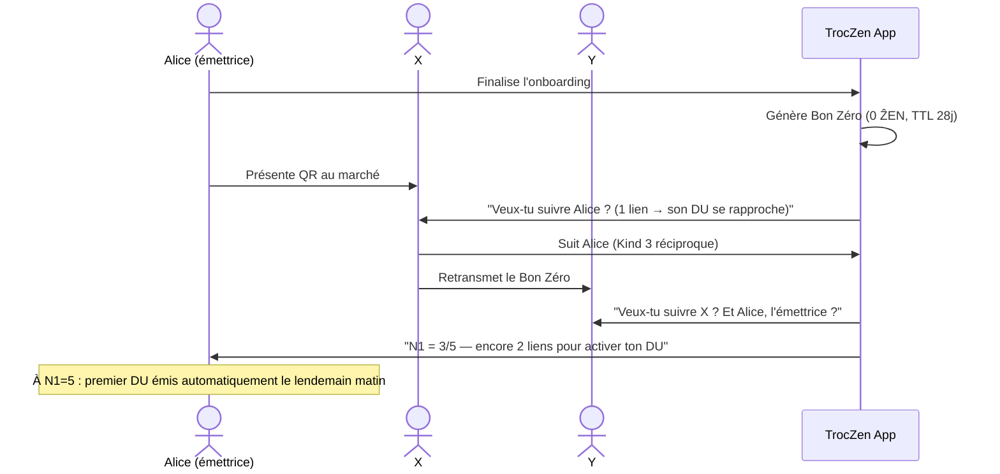

# Flux d'Émission du Dividende Universel (DU) via Nostr P2P

Ce document décrit le flux de calcul et d'émission d'un Dividende Universel (DU) local, basé sur le graphe social Nostr (follows réciproques). La monnaie est portée par des **Bons ẐEN à durée de vie choisie**, détruits à leur retour à l'émetteur et révélant leur parcours. Elle n'est pas enregistrée sur une blockchain globale.

---

## Schéma de Flux Principal (Mermaid)

```mermaid
sequenceDiagram
    autonumber

    actor Alice
    actor Bob
    actor Charlie
    participant App as TrocZen App (Local)
    participant Nostr as Relais Nostr (TrocZen Box)

    %% ÉTAPE 0 : AMORCE SOCIALE
    rect rgb(20, 35, 30)
    Note over Alice, Nostr: 0. Bootstrap — Bon Zéro (0 ẐEN, TTL 28j)
    Alice->>App: Finalise l'onboarding
    App->>App: Génère le Bon Zéro (valeur = 0 ẐEN, TTL = 28j, kind: zero_bond)
    Alice->>Bob: Présente QR du Bon Zéro au marché
    App->>App: Propose à Bob de suivre Alice (Kind 3)
    Bob->>App: Accepte le follow — lien réciproque en cours
    Bob->>Charlie: Transfert du Bon Zéro → propose follow Alice & Bob
    Note over Nostr: Graph social se construit hop par hop
    App->>Alice: "N1 = 4/5 — encore 1 lien pour activer ton DU"
    end

    %% ÉTAPE 1 : CONSTRUCTION DU GRAPHE
    rect rgb(25, 30, 45)
    Note over Alice, Nostr: 1. Toile de Confiance (WoT) — liens réciproques
    Alice->>App: Scan QR Profil Bob
    App->>Nostr: Publie Kind 3 (Contact List) : Follow Bob
    Bob->>App: Scan QR Profil Alice
    App->>Nostr: Publie Kind 3 (Contact List) : Follow Alice
    Note over Nostr: Lien réciproque établi (Alice ↔ Bob) — compte pour N1
    end

    %% ÉTAPE 2 : SYNCHRONISATION
    rect rgb(30, 25, 45)
    Note over Alice, Nostr: 2. Synchronisation Quotidienne
    Alice->>App: Ouvre l'application (matin)
    App->>Nostr: REQ Kind 3 (Contacts) & Kind 30303 (Bons)
    Nostr-->>App: Retourne graphe social + masses monétaires

    App->>App: Calcule N1 (follows réciproques directs)
    App->>App: Calcule N2 (amis d'amis réciproques, sans doublon)

    alt N1 < 5
        App->>Alice: "Confiance insuffisante (N1 = X/5) — continue à tisser des liens"
    else N1 ≥ 5
        App->>App: Calcule M_n1 (masse ẐEN active des N1)
        App->>App: Calcule M_n2 (masse ẐEN active des N2)
    end
    end

    %% ÉTAPE 3 : CALCUL DU DU
    rect rgb(20, 35, 30)
    Note over App: 3. Calcul du DU_i(t+1)
    App->>App: DU = DU_current + C² × (M_n1 + M_n2/√N2) / (N1 + √N2)
    App->>App: Conseil TTL & coupures selon historique personnel
    App->>App: Vérifie horodatage (1 DU/jour max)
    end

    %% ÉTAPE 4 : ÉMISSION
    rect rgb(30, 25, 45)
    Note over Alice, Nostr: 4. Émission des Bons ẐEN
    App->>App: Découpe DU en coupures standards (1,2,5,10,20,50)
    App->>App: Pour chaque bon : SSSS(nsec_bon) → P1, P2, P3
    App->>App: path[] initialisé : [HMAC(Alice.pubkey, bon_id)]
    App->>Nostr: Publie Kind 30303 (P3 chiffré + preuve WoT)
    App->>Alice: "Nouveau DU : +X ẐEN (Y.YY DU) — TTL conseillé : Z jours"
    end

    %% ÉTAPE 5 : TRANSFERT P2P
    rect rgb(20, 35, 30)
    Note over Alice, Charlie: 5. Transfert P2P hors-ligne (Double Scan)
    Alice->>Charlie: Scan 1 — Offre (QR bon + TTL résiduel visible)
    Charlie->>Alice: Scan 2 — ACK signé (Charlie voit TTL avant d'accepter)
    App->>App: hop_count++ · path[].append(HMAC(Charlie.pubkey, bon_id))
    Note over App: expires_at inchangé — le TTL continue de s'écouler
    end

    %% ÉTAPE 6 : VIE DU BON
    rect rgb(30, 25, 45)
    Note over Alice, Nostr: 6. Cycle de vie du Bon
    alt TTL résiduel < seuil (défaut 3j)
        App->>Charlie: "⚠️ Bon expire dans Xj — proposer rachat à l'émetteur ?"
        Charlie->>App: Accepte → DM Nostr (Kind 4) à Alice
        Alice->>Charlie: Double scan rachat → Alice reçoit son bon, émet nouveau bon frais
    else Retour organique à Alice
        App->>Alice: "🎉 Boucle fermée ! X ẐEN · Y hops · Z jours · parcours révélé"
        App->>App: Détruit le bon · publie Kind 30304 (BonCircuit)
    else TTL = 0 (expiration)
        App->>App: Archivage silencieux · log "bon expiré sans retour"
    end
    end
```



---

## Explication des Étapes

### 0. Bootstrap — Le Bon Zéro

Il n'y a pas de création monétaire artificielle au démarrage. Un nouvel utilisateur reçoit un **Bon à 0 ẐEN** — objet cryptographique complet mais sans valeur monétaire, dont la seule fonction est de **propager le graphe social** nécessaire à l'activation du DU.

Le Bon Zéro est le bien le plus précieux du système à l'amorçage : il ne crée pas de richesse artificielle, il crée la **topologie** qui rendra toute richesse future possible.

**Mécanique de propagation :**

- Alice émet le Bon Zéro à l'issue de l'onboarding (`value = 0`, `TTL = 28j`, `kind: zero_bond`)
- À chaque transfert X→Y, l'app propose à Y de suivre X, et de suivre Alice (l'émettrice originale)
- Le follow reste une **invitation, jamais un péage** — on peut recevoir et retransmettre le Bon Zéro sans suivre personne
- Dès que Alice atteint `N1 ≥ 5` liens réciproques, le DU quotidien s'active automatiquement
- **Régénération** : Si Alice a transféré son Bon Zéro et elle peut en régénérer un nouveau Bon Zéro (toujours à 0 ẐEN) avec la **même date d'expiration** que le Bon Zéro initial.- À expiration (28j) ou retour à Alice, le Bon Zéro est détruit et son parcours révèle la **carte des premiers liens** de la communauté naissante



**Messages UX recommandés :**

| Moment | Message |
|---|---|
| Réception Bon Zéro | *"[Nom] t'invite dans son réseau de confiance. Veux-tu le suivre ? (Ton DU se rapproche)"* |
| Re-transfert X→Y | *"[X] t'a transmis ce bon. Veux-tu suivre [X] ? Et [Alice], l'émettrice ?"* |
| N1 = 4 (presque) | *"Il te manque 1 lien réciproque. Qui veux-tu inviter ?"* |
| N1 = 5 atteint | *"🎉 Ton réseau est actif — tu reçois ton premier DU demain matin."* |

---

### 1. Construction de la Toile de Confiance (WoT)

Les relations sociales sont portées par les événements `Kind 3` (Contact List) de Nostr. Un lien n'est valide pour la création monétaire que s'il est **réciproque** : Alice suit Bob ET Bob suit Alice. Cela encode une certification mutuelle sans autorité centrale.

- **N1** : liens directs réciproques (amis)
- **N2** : liens des amis (amis d'amis), sans double comptage
- **Seuil d'activation** : `N1 ≥ 5` — protection contre les attaques Sybil

La résistance Sybil est assurée par la formule elle-même : créer des faux comptes augmente le dénominateur `(N1 + √N2)` plus vite que le numérateur, rendant l'attaque économiquement non rentable.

---

### 2. Synchronisation Quotidienne

Chaque matin, l'application se synchronise avec le relais local (TrocZen Box). Elle calcule :

- **M_n1** : somme des masses ẐEN *actives* (bons non expirés) des N1
- **M_n2** : somme des masses ẐEN actives des N2

Seuls les bons dont le TTL résiduel est positif entrent dans le calcul — la thésaurisation de bons quasi-expirés ne gonfle pas artificiellement la masse.

---

### 3. Calcul Mathématique du DU

Si `N1 ≥ 5`, l'application calcule le DU selon la formule TRM adaptée au réseau local :

```
DU_i(t+1) = DU_i(t) + C² × (M_n1 + M_n2 / √N2) / (N1 + √N2)
```

**Propriétés mathématiques :**

| Terme | Rôle |
|---|---|
| `C²` | Constante de croissance (calibrée localement) |
| `M_n1 / N1` | Richesse moyenne du réseau proche — dilue l'avantage des "riches" |
| `M_n2 / √N2` | Réseau étendu amorti — évite l'explosion exponentielle |
| `√N2` au dénominateur | Invariance d'échelle : si toute la masse double, le DU double |

*Ce n'est pas la richesse de tes contacts qui compte — c'est la **densité de leurs interconnexions**.*

**Conseil TTL & coupures :** l'app analyse l'historique personnel (âge moyen de retour des bons, taux d'expiration) et suggère un TTL cohérent avec la liquidité réelle du réseau. Ce conseil est affiché de façon non-bloquante — l'utilisateur reste libre.

---

### 4. Émission des Bons ẐEN

Le montant du DU est découpé en **coupures standards** (1, 2, 5, 10, 20, 50 ẐEN) pour faciliter les échanges au marché. L'app suggère une répartition basée sur les montants habituellement échangés dans la communauté locale.

Pour chaque bon généré :

1. `SSSS(nsec_bon) → P1, P2, P3` (partage de secret de Shamir)
2. `path[]` initialisé avec `HMAC(émetteur.pubkey, bon_id)` — **anonymisation dès la création**
3. `expires_at = now() + TTL_choisi` — **immuable**, ne sera jamais modifié
4. Publication sur Nostr : `Kind 30303` (P3 chiffré + preuve de calcul WoT)

**Structure d'un Bon ẐEN :**

| Champ | Type | Description |
|---|---|---|
| `bon_id` | uuid | Identifiant unique — sert de clé HMAC |
| `issued_by` | pubkey | Émetteur (pour détection de retour) |
| `issued_at` | timestamp | Date d'émission UTC |
| `expires_at` | timestamp | `issued_at + TTL` — **immuable après création** |
| `value_zen` | float | Valeur nominale en ẐEN |
| `hop_count` | int | Nombre de transferts depuis émission |
| `path[]` | array | `[HMAC(pubkey_i, bon_id)]` — parcours anonymisé |
| `p3_encrypted` | NIP-44 | Part 3 SSSS publiée sur le relais |

---

### 5. Transfert P2P hors-ligne (Double Scan Atomique)

Le transfert se fait entre deux appareils sans connexion réseau requise :

1. **Scan 1 (Offre)** — Alice présente le QR de son bon. Bob voit : valeur, TTL résiduel, nombre de hops. Il peut **refuser sans conséquence** si le TTL est trop faible.
2. **ACK (Accusé)** — L'app de Bob génère un QR d'accusé signé.
3. **Scan 2 (Confirmation)** — Alice scanne l'ACK. Transfert effectif :
   - `hop_count++`
   - `path[].append(HMAC(Bob.pubkey, bon_id))`
   - `expires_at` **inchangé** — le TTL continue de s'écouler depuis l'émission

> **Règle fondamentale :** le passeur ne peut pas modifier le TTL. Le TTL est une déclaration de confiance signée par l'émetteur — l'allonger emprunterait une confiance non émise, le réduire forcerait une urgence non consentie.

La synchronisation avec la TrocZen Box se fait en différé, à la prochaine connexion réseau.

---

### 6. Cycle de Vie du Bon — Les Trois Destins

#### 6a. Rachat Volontaire (TTL critique)

Quand le TTL résiduel passe sous le seuil d'alerte (défaut : 3 jours, configurable par la communauté) :

- L'app affiche une alerte visuelle (bon en rouge dans le portefeuille)
- Propose au porteur de contacter l'émetteur via DM Nostr chiffré (Kind 4)
- Si l'émetteur accepte : double scan → il reçoit son bon (boucle fermée, parcours révélé), émet un nouveau bon frais au porteur
- Si l'émetteur refuse ou ne répond pas (délai 24h) : aucune pénalité, le bon continue son TTL

Le rachat est toujours **volontaire et bilatéral**. Il n'est pas une garantie — il est une négociation sociale assistée par l'app.

#### 6b. Retour Organique à l'Émetteur (Boucle fermée)

Quand un bon revient au portefeuille de sa clé d'émission (`issued_by == ma_pubkey`) :

- **Destruction immédiate**
- Révélation du parcours : l'émetteur tente `HMAC(pubkey_connue, bon_id)` pour chaque contact N1+N2 — les correspondances identifient les porteurs *dans son réseau*. Les porteurs hors réseau restent anonymes même pour l'émetteur.
- Notification : *"🎉 Boucle fermée ! X ẐEN · Y hops · Z jours · [parcours partiel]"*
- Publication `Kind 30304` (BonCircuit) — preuve cryptographique de la boucle, sans révéler les identités

#### 6c. Expiration (TTL = 0)

Archivage silencieux. La valeur est perdue. Log local : *"Bon de X ẐEN expiré sans retour — J+Z"*.

L'expiration n'est pas un échec moral — c'est un **diagnostic** : elle indique où la confiance ne circule pas encore.

---

### Affichage Relativiste

Chaque bon est affiché avec ses deux valeurs :

- **Quantitative** : `10 ẐEN` — pour le calcul mental au marché
- **Relativiste** : `0.94 DU` — calculée dynamiquement (`value_zen / du_du_jour`), recalculée chaque matin, jamais mise en cache plus de 24h

L'affichage relativiste permet de percevoir sa position dans l'économie locale sans référence à une monnaie externe. La valeur en DU déplace la question de *"combien j'ai ?"* vers *"quelle part de la création collective est-ce ?"*

---

## Anatomie de l'Anonymisation (HMAC)

```
path[i] = HMAC-SHA256(pubkey_porteur_i, bon_id)
```

| Qui | Peut voir | Ne peut pas voir |
|---|---|---|
| N'importe qui | Nombre de hops, TTL consommé, valeur, bon_id | Qui a porté le bon |
| Un porteur quelconque | Son propre hop | Les autres porteurs |
| L'émetteur uniquement | Porteurs dans son N1+N2 (par dérivation HMAC) | Porteurs hors de son réseau |

La **transparence** du circuit (a circulé, X hops, Y jours) est préservée pour la santé du réseau. La **vie privée** des porteurs est préservée par défaut.

---

## Métriques de Santé Communautaire

Ces métriques sont calculées par la TrocZen Box et affichées de façon agrégée et anonymisée :

| Métrique | Formule | Seuil sain | Signification |
|---|---|---|---|
| **Ratio de santé** | Boucles fermées / ẐEN expirés (mensuel) | > 1.0× | La confiance se régénère plus vite qu'elle ne s'érode |
| **Vélocité** | Transferts / masse totale / jour | > 0.05 | La monnaie circule, elle ne dort pas |
| **Profondeur** | Hops moyens par boucle | 3–7 | < 3 = réseau trop local, > 10 = fragilité |
| **Taux de rachat** | Rachats / expirations imminentes | > 20% | La communauté prend soin de ses bons |
| **Taux d'activation DU** | Membres N1≥5 / total membres | > 60% | Le bootstrap a bien fonctionné |

---

## Rôles Sociaux Émergents

Le système ne nomme pas ces rôles — il les fait **émerger** de l'activité ordinaire, sans statut ni pouvoir :

| Rôle | Ce que le système mesure | Récompense implicite |
|---|---|---|
| **Tisseurs** | Ponts entre groupes distincts (N2/N1 élevé) | DU plus élevé via réseau étendu dense |
| **Animateurs** | Fort N1 local | DU stable et régulier |
| **Gardiens** | Liens durables, peu d'expirations | Ratio santé élevé |
| **Passeurs** | Boucles longues et riches en hops | Révélation de circuits profonds |

Ces rôles, identifiés après 6 à 12 mois de circulation, dessinent organiquement les contours d'une **coopérative de production**. La gouvernance n'est pas imposée — elle est révélée par les flux de confiance réels.

---

## Règles Protocolaires — Référence Rapide

| # | Règle | Implémentation |
|---|---|---|
| **R1** | TTL min 7j, max 365j | `assert 604800 ≤ ttl_seconds ≤ 31536000` à la création |
| **R2** | `expires_at` immuable après création | Pas de setter exposé, même en interne |
| **R3** | Hop → `hop_count++` uniquement | `expires_at` jamais modifié en transit |
| **R4** | TTL résiduel = `expires_at − now()` | Calculé à la volée, jamais stocké |
| **R5** | Alerte si résiduel < 3j (configurable) | `ALERT_THRESHOLD_SECONDS = 259200` |
| **R6** | Retour émetteur = destruction + révélation | `issued_by == ma_pubkey` vérifié à chaque réception |
| **R7** | Expiration = archivage silencieux | Job horaire : archiver les bons où `expires_at < now()` |
| **R8** | Valeur DU recalculée chaque matin | Ne pas mettre en cache plus de 24h |
| **R9** | Pas de fractionnement | Un bon est atomique — la découpe se fait à la création |
| **R10** | path[] = HMAC, jamais de pubkeys brutes | `path[i] = HMAC-SHA256(pubkey_i, bon_id)` |

---

## Phrases Clés

> **"Ce n'est pas la richesse qui crée la confiance — c'est la confiance qui crée la richesse."**

> **"Le Bon Zéro vaut tout car il ne vaut rien — il permet à tous les autres d'exister."**

> **"La coopérative n'est pas fondée. Elle est révélée."**

---

> *Protocole TrocZen · Bons ẐEN v2 · Nostr Kind 30303/30304 · Fév. 2026*
