# Flux d'Émission du Dividende Universel (DU) via Nostr P2P

Ce document décrit le flux expérimental de calcul et d'émission d'un Dividende Universel (DU) local, basé sur le graphe social Nostr (follows réciproques) plutôt que sur une blockchain globale comme Duniter.

## Schéma de Flux (Mermaid)

```mermaid
sequenceDiagram
    autonumber
    
    actor Alice
    actor Bob
    actor Charlie
    participant App as TrocZen App (Local)
    participant Nostr as Relais Nostr (TrocZen Box)
    
    %% ÉTAPE 1 : CONSTRUCTION DU GRAPHE SOCIAL
    rect rgb(30, 30, 30)
    Note over Alice, Nostr: 1. Construction de la Toile de Confiance (WoT)
    Alice->>App: Scan QR Profil Bob
    App->>Nostr: Publie Kind 3 (Contact List) : Follow Bob
    Bob->>App: Scan QR Profil Alice
    App->>Nostr: Publie Kind 3 (Contact List) : Follow Alice
    Note over Nostr: Lien réciproque établi (Alice ↔ Bob)
    end
    
    %% ÉTAPE 2 : SYNCHRONISATION ET CALCUL DU RÉSEAU
    rect rgb(40, 40, 40)
    Note over Alice, Nostr: 2. Synchronisation Quotidienne
    Alice->>App: Ouvre l'application (Matin)
    App->>Nostr: REQ Kind 3 (Contacts) & Kind 30303 (Soldes/Bons)
    Nostr-->>App: Retourne le graphe social et les masses monétaires
    
    App->>App: Calcule N1 (Amis directs réciproques)
    App->>App: Calcule N2 (Amis des amis réciproques)
    
    alt N1 < 5
        App->>Alice: Affiche "Confiance insuffisante (N < 5)"
    else N1 >= 5
        App->>App: Calcule M_n1 (Somme ẐEN de N1)
        App->>App: Calcule M_n2 (Somme ẐEN de N2)
    end
    end
    
    %% ÉTAPE 3 : CALCUL DU DU
    rect rgb(30, 30, 30)
    Note over App: 3. Calcul Mathématique du DU_i(t+1)
    App->>App: DU_new = DU_current + C² * (M_n1 + sqrt(M_n2)) / (N1 + N2)
    App->>App: Vérifie plafond journalier & horodatage
    end
    
    %% ÉTAPE 4 : ÉMISSION ET PREUVE
    rect rgb(40, 40, 40)
    Note over Alice, Nostr: 4. Émission du DU
    App->>App: Génère un nouveau Bon ẐEN (Valeur = DU_new)
    App->>App: SSSS(nsec_bon) -> P1, P2, P3
    App->>Nostr: Publie Kind 30303 (P3 chiffré + Preuve de calcul WoT)
    App->>Alice: Affiche "Nouveau DU reçu : +X ẐEN"
    end
    
    %% ÉTAPE 5 : UTILISATION
    rect rgb(30, 30, 30)
    Note over Alice, Charlie: 5. Transfert P2P (Marché)
    Alice->>Charlie: Double Scan QR (Offre -> ACK)
    Note over Alice, Charlie: Le DU injecté circule dans l'économie locale
    end
```

## Explication des Étapes

### 1. Construction de la Toile de Confiance (WoT)
Dans l'écosystème Nostr, les relations sociales sont gérées par les événements de type `Kind 3` (Contact List). Pour qu'un lien soit considéré comme valide pour la création monétaire, il doit être **réciproque** (Alice suit Bob ET Bob suit Alice). Cela simule une certification mutuelle.

### 2. Synchronisation et Calcul du Réseau
Chaque matin, l'application TrocZen se synchronise avec le relais local (la TrocZen Box). Elle télécharge le graphe social et les soldes publics (ou les preuves de masse monétaire).
L'application calcule localement :
- **N1** : Le nombre d'amis directs (follows réciproques).
- **N2** : Le nombre d'amis d'amis (sans double comptage).
- **M_n1** : La masse monétaire détenue par N1.
- **M_n2** : La masse monétaire détenue par N2.

### 3. Calcul Mathématique du DU
Si l'utilisateur possède au moins 5 liens réciproques (seuil de sécurité contre la création de faux comptes Sybil), l'application calcule le nouveau DU selon la formule de la TRM adaptée :
`DU_i(t+1) = DU_i(t) + C² * (M_n1 + sqrt(M_n2)) / (N1 + N2)`

### 4. Émission et Preuve (Monnaie Quantitative)
Plutôt que de générer un seul gros bon avec une valeur décimale complexe (ex: 10.45 ẐEN), l'application **découpe automatiquement ce montant en coupures standards** (1, 2, 5, 10, 20, 50) pour optimiser les échanges et le rendu de monnaie sur le marché.
Pour chaque coupure générée :
- L'application calcule SSSS(nsec_bon) -> P1, P2, P3.
- Elle publie la part P3 sur Nostr (Kind 30303) en y attachant une **preuve de calcul** (les pubkeys des N1 et N2 utilisés pour le calcul). Les autres nœuds pourront vérifier que la création monétaire était légitime.

### 5. Utilisation et Affichage Relativiste
Les nouveaux bons sont ajoutés au portefeuille de l'utilisateur.
Dans l'interface utilisateur (UI), la valeur de chaque bon est affichée de deux manières :
- **Valeur quantitative** : ex. "10 ẐEN" (pour faciliter le calcul mental au marché).
- **Valeur relativiste** : ex. "0.95 DU" (calculée dynamiquement par rapport au DU du jour).
Ils peuvent désormais être dépensés sur le marché via le mécanisme de double scan atomique hors-ligne.
