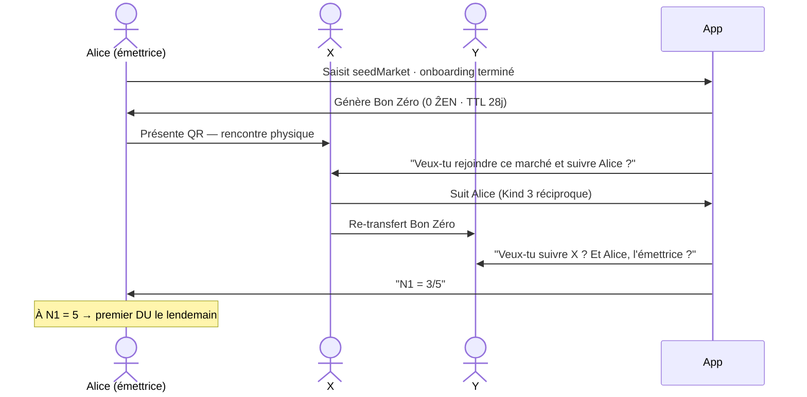

# Protocole TrocZen — Bons ẐEN v4

> Infrastructure de confiance à géométrie variable.
> La monnaie est un cas d'usage parmi d'autres.

Ce document décrit le protocole complet des Bons ẐEN : calibration du DU(0), architecture multi-marchés fongibles/non-fongibles, cycle de vie des bons à TTL décroissant, et le mécanisme fondateur — la **seedMarket** et le **Bon Zéro** comme application de rencontre généralisée.

---

## Concepts Fondateurs

### La seedMarket — frontière de confiance

La `seedMarket` est un **secret partagé entre les membres d'un marché**. Connaître la seed, c'est avoir été invité dans un espace de confiance délimité.

Ce n'est pas un mot de passe technique — c'est une **déclaration d'appartenance**. Elle définit les frontières du marché sans autorité centrale : quiconque connaît la seed peut rejoindre l'espace, créer des liens réciproques, émettre et recevoir des Bons ẐEN locaux.

La seed est distribuée physiquement : au marché du samedi, lors d'une assemblée, d'un festival, d'une fête de quartier. La confiance commence hors-ligne, avant même l'application.

```
seedMarket  →  définit un espace de confiance (un "marché")
Bon Zéro    →  circule dans cet espace, tisse le graphe social
N1 ≥ 5      →  débloque le DU quotidien dans cet espace
```

### Le Bon Zéro — application de rencontre

Le Bon Zéro (`value = 0 ẐEN`, `TTL = 28j`, `kind: zero_bond`) est l'objet social fondateur. Il ne porte pas de valeur monétaire — il porte une **invitation**.

Quand Alice te donne son Bon Zéro, elle te donne en même temps l'accès à son marché et à son réseau de confiance. Le bon *est* l'invitation. À chaque hop, le graphe social se construit. Quand il revient, il révèle la carte des premiers liens de la communauté naissante.

Le Bon Zéro est le bien le plus précieux du système au démarrage :
> Il vaut tout car il ne vaut rien — il permet à tous les autres d'exister.

### Les Bons ẐEN — monnaie à TTL décroissant

Les Bons ẐEN portent une valeur monétaire. Leur TTL est choisi par l'émetteur (7j à 365j), décroit en transit, et ne peut jamais être modifié par un passeur. Ils sont détruits à leur retour à l'émetteur et révèlent leur parcours. La masse monétaire est en **équilibre dynamique** : elle converge vers `M* = DU_journalier × TTL_moyen`.

---

## Calibration du DU(0) et Architecture Multi-Marchés

### Le problème de la valeur initiale

Un DU(0) trop élevé (ex : 100 ẐEN/j → 3 000 ẐEN/mois par marché) est psychologiquement séduisant car il évoque un "bon salaire". Mais dans un contexte multi-marchés, il génère une **fragmentation cognitive** : un utilisateur actif sur 3 marchés reçoit 9 000 unités/mois dans 3 monnaies différentes. Ce n'est pas de l'inflation — c'est de l'illisibilité.

**Ce que DU(0) doit encoder** : une unité qui reste perceptible dans les transactions courantes. Si le DU mensuel vaut 3 000 unités, un pain vaut 0,03 DU — trop petit pour être mental. Si le DU mensuel vaut 300 unités, un pain vaut 3 ẐEN — naturel et calculable de tête au marché.

### Recommandation : DU(0) = 10 ẐEN/jour

Soit **~300 ẐEN/mois** pour un membre actif au seuil minimal (N1 = 5, réseau moyen).

| Profil | N1 | N2/N1 | DU/jour estimé | ẐEN/mois |
|---|---|---|---|---|
| Seuil minimal | 5 | 2× | ~10 ẐEN | ~300 |
| Membre actif | 10 | 5× | ~15 ẐEN | ~450 |
| Tisseur/Passeur | 15 | 10× | ~20 ẐEN | ~600 |
| Maximum réaliste | 25 | 15× | ~28 ẐEN | ~840 |

La dispersion 300–840 ẐEN/mois est **saine** : assez large pour que le réseau soit un signal (pas trop égalitaire), assez resserrée pour que personne ne domine (pas trop inégale).

**L'ancrage psychologique** ("bon salaire") ne doit pas être dans le montant numérique brut — il doit être dans la **convention sociale** définie par la communauté à son lancement :

> *"Dans notre marché, 1 DU = 30 minutes de travail."*
> → 300 ẐEN/mois = 150 heures = temps plein.

C'est la communauté qui décide de cette convention, pas le protocole. Elle est révisable en assemblée.

### En multi-marchés — lisibilité préservée

Avec DU(0) = 10 ẐEN/j, un utilisateur actif sur 3 marchés :

```
Alice — Marchés actifs
┌─────────────────────────────────────────────────────────┐
│ 🌿 Marché des Producteurs  →  ~15 ẐEN[Prod]/j   N1: 8  │
│ 🔧 Collectif Artisans       →  ~12 ẐEN[Art]/j    N1: 6  │
│ 🏘️  Quartier Jolimont        →  ~10 ẐEN[Qrt]/j   N1: 5  │
├─────────────────────────────────────────────────────────┤
│ Si fongibilité activée : ~37 ẐEN/j · ~1 110 ẐEN/mois   │
│ Si non fongibles : 3 portefeuilles de ~300–450 ẐEN/mois │
└─────────────────────────────────────────────────────────┘
```

Chaque portefeuille reste lisible. L'agrégation reste dans des ordres de grandeur maniables.

---

### Architecture des couches ẐEN — Fongible et Non-Fongibles

L'application est structurée en couches distinctes. Chaque couche a son interface propre.

```
┌──────────────────────────────────────────────────────────────┐
│  COUCHE GLOBALE — ẐEN Fongible                               │
│  Règles de conversion décidées par consensus inter-marchés   │
│  Taux d'échange librement fixés et révisables en assemblée   │
├─────────────┬─────────────┬─────────────┬────────────────────┤
│ ẐEN[Prod]  │ ẐEN[Art]   │ ẐEN[Qrt]   │ ẐEN[...]           │
│ DU local   │ DU local    │ DU local    │ DU local           │
│ TTL propre │ TTL propre  │ TTL propre  │ TTL propre         │
│ Règles     │ Règles      │ Règles      │ Règles             │
│ propres    │ propres     │ propres     │ propres            │
└─────────────┴─────────────┴─────────────┴────────────────────┘
```

**Couche globale ẐEN fongible** — ce n'est pas une monnaie de plus. C'est un **protocole d'échange** entre marchés. Elle peut exister sous deux formes :
- **Conversion explicite** : 1 ẐEN[Prod] = 0.8 ẐEN[Art] (taux fixé par les deux communautés en assemblée)
- **Agrégation directe** : si deux marchés décident que leurs ẐEN sont de même valeur, les bons sont interchangeables sans conversion

**Couches locales non-fongibles** — chaque marché est souverain. Ses ẐEN ne valent que dans son espace, selon ses règles, avec ses paramètres C², TTL par défaut, seuil d'alerte.

**Règles de fongibilité** (stockées dans la seedMarket ou votées en assemblée) :
- `fongible: false` → défaut, aucun échange inter-marchés
- `fongible: [market_id, rate]` → échange possible vers ce marché à ce taux
- `fongible: global` → tous les marchés du réseau TrocZen sont interchangeables au pair

### Interface de l'application — Parties distinctes

L'app est organisée en sections clairement séparées :

| Section | Contenu | Logique |
|---|---|---|
| **Vue globale** | Total ẐEN convertis, ratio santé agrégé, boucles toutes marchés | Couche fongible |
| **Vue par marché** | DU local, bons actifs, métriques, membres | Une vue par seedMarket |
| **Conversion** | Taux inter-marchés, historique des échanges | Activé si fongibilité décidée |
| **Bon Zéro** | Bons actifs, propagation en cours, N1 par marché | Amorce sociale |

---

## Schéma de Flux Complet

```mermaid
sequenceDiagram
    autonumber

    actor Alice
    actor Bob
    actor Charlie
    participant App as TrocZen App (Local)
    participant Box as TrocZen Box (Relais Nostr)

    %% ÉTAPE 0 : ENTRÉE DANS UN MARCHÉ
    rect rgb(15, 30, 25)
    Note over Alice, Box: 0. Rejoindre un marché — seedMarket
    Alice->>App: Saisit la seedMarket (reçue physiquement)
    App->>App: Dérive l'espace de confiance depuis la seed
    App->>App: Génère le Bon Zéro (0 ẐEN · TTL 28j · kind: zero_bond)
    App->>Box: S'abonne au relais local associé à la seed
    end

    %% ÉTAPE 1 : AMORCE SOCIALE
    rect rgb(20, 35, 30)
    Note over Alice, Box: 1. Bon Zéro — tisser le graphe social
    Alice->>Bob: Présente QR du Bon Zéro au marché (physique)
    App->>Bob: "Recevoir le bon d'Alice — Veux-tu la suivre ?"
    Bob->>App: Suit Alice (Kind 3) · lien réciproque en cours
    Bob->>Charlie: Re-transfert → propose follow Alice & Bob
    App->>Alice: "N1 = 3/5 — encore 2 liens pour activer ton DU"
    Note over Box: À N1=5 : DU quotidien activé dès le lendemain
    end

    %% ÉTAPE 2 : SYNCHRONISATION QUOTIDIENNE
    rect rgb(25, 30, 45)
    Note over Alice, Box: 2. Synchronisation quotidienne (matin)
    Alice->>App: Ouvre l'application
    App->>Box: REQ Kind 3 (Contacts) & Kind 30303 (Bons actifs)
    Box-->>App: Graphe social + masses monétaires actives

    App->>App: Calcule N1 (follows réciproques directs)
    App->>App: Calcule N2 (amis d'amis réciproques, sans doublon)

    alt N1 < 5
        App->>Alice: "N1 = X/5 — continue à tisser des liens"
    else N1 ≥ 5
        App->>App: Calcule M_n1 (masse ẐEN active des N1)
        App->>App: Calcule M_n2 (masse ẐEN active des N2)
    end
    end

    %% ÉTAPE 3 : CALCUL DU DU
    rect rgb(15, 30, 25)
    Note over App: 3. Calcul DU_i(t+1)
    App->>App: DU = DU_t + C² × (M_n1 + M_n2/√N2) / (N1 + √N2)
    App->>App: Conseil TTL & coupures selon historique
    App->>App: Vérifie horodatage (1 DU/jour max)
    end

    %% ÉTAPE 4 : ÉMISSION
    rect rgb(25, 30, 45)
    Note over Alice, Box: 4. Émission des Bons ẐEN
    App->>App: Découpe DU en coupures standards (1·2·5·10·20·50)
    App->>App: Pour chaque bon : SSSS(nsec_bon) → P1, P2, P3
    App->>App: path[] ← [HMAC(Alice.pubkey, bon_id)]
    App->>App: expires_at = now() + TTL choisi  [IMMUABLE]
    App->>Box: Publie Kind 30303 (P3 chiffré + preuve WoT)
    App->>Alice: "+X ẐEN · Y.YY DU · TTL conseillé : Z jours"
    end

    %% ÉTAPE 5 : TRANSFERT P2P
    rect rgb(15, 30, 25)
    Note over Alice, Charlie: 5. Transfert hors-ligne (Double Scan)
    Alice->>Charlie: Scan 1 — Offre (valeur + TTL résiduel visible)
    Charlie->>Alice: Scan 2 — ACK signé (Charlie voit et accepte)
    App->>App: hop_count++ · path[].append(HMAC(Charlie.pubkey, bon_id))
    Note over App: expires_at inchangé — TTL continue de s'écouler
    end

    %% ÉTAPE 6 : CYCLE DE VIE
    rect rgb(25, 30, 45)
    Note over Alice, Box: 6. Cycle de vie — trois destins
    alt TTL résiduel < seuil (défaut 3j) → Rachat volontaire
        App->>Charlie: "⚠️ Expire dans Xj — proposer rachat à Alice ?"
        Charlie->>Box: DM Kind 4 chiffré → Alice
        Alice->>Charlie: Double scan rachat → boucle fermée + nouveau bon frais
    else Retour organique → Boucle fermée
        App->>Alice: "🎉 Boucle fermée · X ẐEN · Y hops · Z jours"
        App->>App: Destruction · déchiffrement HMAC partiel du parcours
        App->>Box: Publie Kind 30304 (BonCircuit — preuve sans identités)
    else TTL = 0 → Expiration
        App->>App: Archivage silencieux · diagnostic réseau
    end
    end
```

---

## Explication des Étapes

### 0. Rejoindre un marché — seedMarket

La `seedMarket` est saisie ou scannée lors du premier contact physique avec la communauté. L'app dérive depuis cette seed :
- L'**identité du marché** (namespace Nostr)
- L'**adresse du relais** TrocZen Box associé
- Les **paramètres locaux** : `C²`, TTL par défaut, seuil d'alerte, règles de fongibilité inter-marchés

Un utilisateur peut appartenir à **plusieurs marchés simultanément**, chacun avec sa seed, son DU local, ses règles propres. Son portefeuille segmente les ẐEN par marché.

### 1. Bon Zéro — Amorce Sociale

Cf. section dédiée ci-dessous.

### 2. Synchronisation Quotidienne

Chaque matin, l'app synchronise avec la TrocZen Box. Elle calcule :
- **N1** : liens réciproques directs dans le marché
- **N2** : amis d'amis réciproques, sans doublon
- **M_n1 / M_n2** : masses ẐEN *actives* uniquement (bons non expirés)

### 3. Calcul du DU

```
DU_i(t+1) = DU_i(t) + C² × (M_n1 + M_n2 / √N2) / (N1 + √N2)
```

| Terme | Rôle |
|---|---|
| `C²` | Constante locale — calibrée par la communauté |
| `M_n1 / N1` | Richesse moyenne du réseau proche, diluée |
| `M_n2 / √N2` | Réseau étendu amorti — pas d'explosion exponentielle |
| `√N2` au dénominateur | Invariance d'échelle TRM |

Ce n'est pas la richesse des contacts qui compte — c'est la **densité de leurs interconnexions**.

### 4. Émission des Bons ẐEN

Le DU est découpé en coupures standards adaptées aux échanges locaux habituels. Pour chaque bon :
- `SSSS(nsec_bon) → P1, P2, P3`
- `path[]` initialisé avec `HMAC(émetteur.pubkey, bon_id)`
- `expires_at = now() + TTL` — **immuable dès la création**

### 5. Transfert P2P — Double Scan Atomique

Hors-ligne, sans réseau. Charlie voit le TTL résiduel **avant** d'accepter — il peut refuser sans conséquence. À la confirmation :
- `hop_count++`
- `path[].append(HMAC(Charlie.pubkey, bon_id))`
- `expires_at` inchangé

> **Le passeur ne peut pas modifier le TTL.** Le TTL est une déclaration de confiance signée par l'émetteur.

### 6. Cycle de Vie — Trois Destins

**Rachat volontaire** (TTL critique) : le porteur contacte l'émetteur via DM Nostr chiffré. Si accord : double scan → boucle fermée + nouveau bon frais. Toujours volontaire, jamais automatique.

**Retour organique** (boucle fermée) : destruction immédiate, révélation partielle du parcours via déchiffrement HMAC, notification, publication `Kind 30304`.

**Expiration** (TTL = 0) : archivage silencieux. Ce n'est pas un échec moral — c'est un **diagnostic** : il indique où la confiance ne circule pas encore.

---

## Le Bon Zéro — Application de Rencontre

### Principe

Le Bon Zéro est la **primitive sociale** du système. Il découple le démarrage de l'économie de la création monétaire : avant qu'un ẐEN de valeur existe, la confiance doit exister.

Son mécanisme est générique — il s'applique à tout type de marché :



### Propagation des follows — règles UX

| Moment | Message proposé |
|---|---|
| Réception Bon Zéro | *"[Nom] t'invite dans son espace de confiance. Veux-tu le suivre ?"* |
| Re-transfert X→Y | *"[X] t'a transmis ce bon. Veux-tu suivre [X] ? Et [Alice], l'émettrice ?"* |
| N1 = 4 | *"Il te manque 1 lien pour activer ton DU. Qui veux-tu inviter ?"* |
| N1 = 5 | *"🎉 Réseau actif — premier DU demain matin."* |

> Le follow est une **invitation, jamais un péage**. On peut recevoir et retransmettre le Bon Zéro sans suivre personne.

---

## La seedMarket — Taxonomie des Marchés

La seedMarket rend le protocole **générique**. Tout espace de confiance qui a besoin de se reconnaître, tisser des liens et faire circuler de la valeur peut s'en emparer.

### Marchés de production physique

**Marché de producteurs alimentaires** *(cas fondateur)*
La seed circule au marché du samedi ou lors d'une réunion d'AMAP. Le Bon Zéro sert à se présenter entre maraîchers, éleveurs, transformateurs, cuisiniers. Le DU encode la *complémentarité* des productions : un réseau avec légumiers + fromager + boulanger génère plus qu'un réseau de 10 légumiers identiques. TTL typique : 28–90j (cycles de livraison et de saison).

**Coopérative artisanale**
Menuisiers, tisserands, potiers, cordonniers. La seed passe de main en main lors d'une foire. Le Bon Zéro circule dans les ateliers partagés. Les boucles révèlent les chaînes de production : qui fournit qui, quelle matière transite.

### Marchés de compétences et de services

**Collectif de freelances / SEL numérique**
Développeurs, graphistes, traducteurs, comptables. La seed est partagée lors d'un coworking ou d'un meetup. TTL long (90–180j) pour les cycles de projet. Le DU encode la complémentarité des compétences.

**Université populaire / réseau de tutorat**
La seed est dans le programme du premier cours. Le Bon Zéro circule entre étudiants et formateurs. Le DU encode la transmission : ceux qui enseignent ET apprennent génèrent plus que ceux qui font l'un sans l'autre.

**Réseau de soin / aidants**
Un réseau d'aidants, une AMAP de santé, un groupe de patients experts. La seed est distribuée par une association. La monnaie ẐEN encode du temps de présence et d'accompagnement. Les boucles révèlent les réseaux de soutien réels — invisibles aux institutions.

### Marchés de territoire

**Marché de voisinage**
Une rue, un quartier, une copropriété. La seed est partagée à la fête des voisins ou à l'assemblée de copropriété. Échanges quotidiens : garder un enfant, prêter un outil, partager un trajet. TTL court (7–14j), boucles rapides. Le DU encode la densité sociale du lieu.

**Territoire rural / bassin de vie**
Un canton, une communauté de communes. La seed circule via les associations locales. Les producteurs, artisans et services se retrouvent dans le même espace. Le DU encourage les liens inter-secteurs.

### Marchés temporaires

**Festival / hackathon / conférence**
La seed est imprimée sur le badge ou dans le programme. Le Bon Zéro a un TTL ultra-court (3–5j = durée de l'événement). À la clôture, les boucles fermées révèlent qui a vraiment collaboré — une cartographie vivante de l'événement.

**Chantier participatif**
Construction collective, rénovation partagée. La seed circule entre participants. Les bons ẐEN encodent les contributions en temps et matériaux. Les boucles révèlent les chaînes d'entraide réelles.

### Marchés de gouvernance et de communs

**Coopérative de production**
La seed est le secret fondateur de la coopérative. Les bons ẐEN et leurs boucles constituent la **mémoire économique** de la coopérative : qui a produit, qui a transmis, quels circuits se sont formés. Après 6–12 mois, les patterns révèlent la structure de gouvernance naturelle.

**Commun numérique / logiciel libre**
Une communauté open-source. La seed circule via les canaux de contribution. Le DU encode la diversité des contributions (code, documentation, traduction, support). Les boucles révèlent les dépendances réelles entre contributeurs.

### Réseau de réseaux (méta-marchés)

Plusieurs marchés peuvent partager une **meta-seed** qui crée un espace inter-marchés. Les membres présents dans plusieurs marchés deviennent des **passeurs inter-espaces** — leur DU agrégé reflète leur rôle de pont.

```
Marché Producteurs  ←─ Alice (passeur) ─→  Marché Artisans
                                ↕
                      Marché Quartier
```

La question politique centrale que chaque communauté doit décider : les ẐEN de différents marchés sont-ils **fongibles** entre eux ? La seed peut encoder cette règle.

---

## Multi-marchés — Portefeuille Segmenté

Un utilisateur appartient simultanément à plusieurs marchés :

```
Alice — Marchés actifs
┌─────────────────────────────────────────────────────┐
│ 🌿 Marché des Producteurs   DU: 2.3 ẐEN/j  N1: 8   │
│ 🔧 Collectif Artisans        DU: 1.1 ẐEN/j  N1: 6   │
│ 🏘️  Quartier Jolimont        DU: 0.8 ẐEN/j  N1: 5   │
└─────────────────────────────────────────────────────┘
  Total DU quotidien : 4.2 ẐEN (si fongibilité activée)
  Boucles ce mois : 12 · Ratio santé : 1.4×
```

Chaque marché a son propre DU, ses propres bons, ses propres métriques. La fongibilité est une décision locale.

---

## Anonymisation du Parcours (HMAC)

```
path[i] = HMAC-SHA256(pubkey_porteur_i, bon_id)
```

| Qui | Peut voir | Ne peut pas voir |
|---|---|---|
| N'importe qui | Hops, TTL consommé, valeur, bon_id | Identités des porteurs |
| Un porteur | Son propre hop | Les autres |
| L'émetteur | Porteurs dans son N1+N2 (dérivation HMAC) | Porteurs hors réseau |

Transparence du circuit préservée. Vie privée des porteurs préservée par défaut.

---

## Métriques de Santé par Marché

| Métrique | Formule | Seuil sain | Signification |
|---|---|---|---|
| **Ratio de santé** | Boucles / ẐEN expirés (mensuel) | > 1.0× | La confiance se régénère |
| **Vélocité** | Transferts / masse / jour | > 0.05 | La monnaie circule |
| **Profondeur** | Hops moyens par boucle | 3–7 | Équilibre local/étendu |
| **Taux de rachat** | Rachats / expirations imminentes | > 20% | Soin collectif des bons |
| **Taux d'activation DU** | Membres N1≥5 / total | > 60% | Bootstrap réussi |
| **Diversité N1** | Variété des secteurs en N1 | > 3 secteurs | Complémentarité réelle |

---

## Rôles Sociaux Émergents

| Rôle | Signal mesuré | Ce que ça révèle |
|---|---|---|
| **Tisseurs** | N2/N1 élevé, ponts inter-groupes | Architectes de la confiance étendue |
| **Animateurs** | Fort N1, boucles courtes fréquentes | Moteurs de la liquidité locale |
| **Gardiens** | Liens durables, faible taux d'expiration | Garants de la qualité du réseau |
| **Passeurs** | Présents dans plusieurs marchés | Connecteurs inter-espaces |
| **Fondateurs** | Bon Zéro à fort N2 final | Semeurs de communautés |

Ces rôles émergent de l'activité ordinaire. Après 6–12 mois, ils dessinent organiquement la **coopérative de production** — sans qu'on l'ait fondée.

---

## Règles Protocolaires — Référence Développeur

| # | Règle | Implémentation |
|---|---|---|
| **R0** | seedMarket dérive l'espace Nostr | `namespace = HKDF(seed, "troczen-market")` |
| **R1** | TTL min 7j, max 365j | `assert 604800 ≤ ttl_seconds ≤ 31536000` |
| **R2** | `expires_at` immuable après création | Pas de setter — champ `readonly` |
| **R3** | Hop → `hop_count++` uniquement | `expires_at` jamais modifié en transit |
| **R4** | TTL résiduel = `expires_at − now()` | Calculé à la volée, jamais stocké |
| **R5** | Alerte si résiduel < 3j (configurable) | `ALERT_THRESHOLD_SECONDS = 259200` |
| **R6** | Retour émetteur = destruction + révélation | `issued_by == ma_pubkey` à chaque réception |
| **R7** | Expiration = archivage silencieux | Job horaire : archiver si `expires_at < now()` |
| **R8** | Valeur DU recalculée chaque matin | Cache max 24h |
| **R9** | Pas de fractionnement | Un bon est atomique |
| **R10** | `path[]` = HMAC uniquement | `HMAC-SHA256(pubkey_i, bon_id)` |
| **R11** | Bon Zéro non fongible avec bons ẐEN | `kind: zero_bond` traité séparément |
| **R12** | Multi-marchés segmentés par seed | DU calculé par espace, bons tagués `market_id` |
| **R13** | DU(0) = 10 ẐEN/jour par marché | `DU_INITIAL = 10` dans les paramètres de la seedMarket |
| **R14** | Fongibilité = règle locale explicite | `fongible: false` par défaut — opt-in, jamais opt-out |

---

## Phrases Clés

> **"Ce n'est pas la richesse qui crée la confiance — c'est la confiance qui crée la richesse."**

> **"Le Bon Zéro vaut tout car il ne vaut rien — il permet à tous les autres d'exister."**

> **"La seedMarket n'est pas un mot de passe. C'est une déclaration d'appartenance."**

> **"La coopérative n'est pas fondée. Elle est révélée."**

---

*Protocole TrocZen · Bons ẐEN v4 · Nostr Kind 3 / 30303 / 30304 · Fév. 2026*
